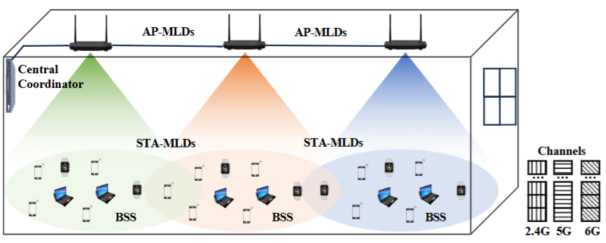

**Post-Doctoral Fellow**

{: .text-justify} 
Department of Electronic and Computer Engineering (ECE) 

{: .text-justify}
The Hong Kong University of Science and Technology (HKUST) 

---
### Biography

{: .text-justify}
Hello! I am Jingwen Tong, a Post-Doctoral Fellow in the Department of Electronic and Computer Engineering at The Hong Kong University of Science and Technology (HKUST). I will be an Assistant Professor in the College of Electronics and Information Engineering at Shenzhen University from January 1, 2026.
Before that, I was a visiting scholar at the University of Houston, USA, in 2020. I obtained my Ph.D. degree from the School of Informatics at Xiamen University in 2022, and the M.Phil. in Electrical Engineering from Ningbo University in 2018, and the B.E. in Communication Engineering from China Jiliang University in 2015.

{: .text-justify}
My research focuses on LLM-based AI agents and multi-armed bandits (MAB), with applications in wireless communications. I am broadly interested in building learning systems that make sequential decisions under uncertainty, efficiently explore large action spaces, and achieve robust performance in real-world networked environments.

---
### Work Experience

{: .text-justify}
* 2022.06- Now, Post-Doctoral Fellow, Department of Electronic and Computer Engineering, The Hong Kong University of Science and Technology. Supervisor: Prof. [Jun Zhang](https://eejzhang.people.ust.hk/) and work closely with Prof. [Khaled Ben Letaief](https://facultyprofiles.hkust.edu.hk/profiles.php?profile=khaled-ben-letaief-eekhaled)  
* 2019.10-2020.11, Visiting Scholar, Department of Electrical and Computer Engineering, University of Houston. Supervisors: Prof. [Zhu Han](http://www2.egr.uh.edu/~zhan2/) and Prof. [Liqun Fu](https://funlab2017.github.io/liqun.html);

---
### Recent Projects

- **[WirelessAgent: Large language Model Agents for Intelligent Wireless Networks (ChinaComm 2026)](https://github.com/jwentong/WirelessAgent_R1)**  
    

        
 This work introduces WirelessAgent, a novel framework that harnesses large language models (LLMs) to create autonomous AI agents for diverse wireless network tasks. It first defines a general framework for WirelessAgent, supported by key components and principles in AI agents. Then, it introduces a basic usage to implement the WirelessAgent based on agentic workflows and the LangGraph architecture. 

        <a href="https://arxiv.org/pdf/2505.01074" class="button-link">Read Paper</a>
        <a href="https://github.com/jwentong/WirelessAgent_R1" class="button-link">Github Code</a>
  

  

  

    <iframe
      src="https://www.youtube-nocookie.com/embed/4fqADkT_XMc"
      title="YouTube video player"
      style="position:absolute;top:0;left:0;width:100%;height:100%;border:0;"
      allow="accelerometer; clipboard-write; encrypted-media; gyroscope; picture-in-picture; web-share"
      allowfullscreen
      referrerpolicy="strict-origin-when-cross-origin">
    </iframe>
  

- **[WRF-GS: Wireless Radiation Field Reconstruction with 3D Gaussian Splatting (INFOCOM 2025)](https://arxiv.org/pdf/2412.04832)** 
    

        
 Wireless channel modeling plays a pivotal role in designing, analyzing, and optimizing wireless communication systems. Nevertheless, developing an effective channel modeling approach has been a longstanding challenge. This issue has been escalated due to the denser network deployment, larger antenna arrays, and wider bandwidth in 5G and beyond networks. To address this challenge, we put forth WRF-GS, a novel framework for channel modeling based on wireless radiation field (WRF) reconstruction using 3D Gaussian splatting. WRF-GS employs 3D Gaussian primitives and neural networks to capture the interactions between the environment and radio signals, enabling efficient WRF reconstruction and visualization of the propagation characteristics. The reconstructed WRF can then be used to synthesize the spatial spectrum for comprehensive wireless channel characterization. Notably, with a small number of measurements, WRF-GS can synthesize new spatial spectra within milliseconds for a given scene, thereby enabling latency-sensitive applications.

        <a href="https://arxiv.org/pdf/2412.04832" class="button-link">Read Paper</a>
        <a href="https://github.com/wenchaozheng/WRF-GSplus" class="button-link">Github Code</a>
    

    

- **[Intelligent Channel Allocation for IEEE 802.11be Multi-Link Operation: When MAB Meets LLM (JSAC 2025)](https://www.arxiv.org/abs/2506.04594)** 
  

    
 This work addresses the dynamic channel allocation problem in dense WiFi 7 networks with multi-link operation capabilities. It formulates this channel allocation problem as a combinatorial optimization problem, which then can be modeled as a Multi-Armed Bandit (MAB) framework. It proposes a Best-Arm Identification-enabled Monte Carlo Tree Search (BAI-MCTS) algorithm to solve this MAB problem. To further reduce sample complexity and enhance generalizability across diverse network scenarios, it put forth LLM-BAI-MCTS, an intelligent algorithm for the dynamic channel allocation problem by integrating the Large Language Model (LLM) into the BAI-MCTS algorithm.

    <a href="https://www.arxiv.org/abs/2506.04594" class="button-link">Read Paper</a>
    <a href="https://github.com/Lianshumin576/MLOandMCTS" class="button-link">Github Code</a>
  

  

- **[WirelessLLM: Empowering Large Language Models Towards Wireless Intelligence (JCIN 2024)](https://arxiv.org/pdf/2405.17053)**  
    

        
 This paper proposes WirelessLLM, a comprehensive framework for adapting and enhancing LLMs to address the unique challenges and requirements of wireless communication networks. We first identify three foundational principles that underpin WirelessLLM: knowledge alignment, knowledge fusion, and knowledge evolution. Then, we investigate the enabling technologies to build WirelessLLM, including prompt engineering, retrieval augmented generation, tool usage, multi-modal pre-training, and domain-specific fine-tuning. Moreover, we present three case studies to demonstrate the practical applicability and benefits of WirelessLLM for solving typical problems in wireless networks. Finally, we conclude this paper by highlighting key challenges and outlining potential avenues for future research. 

        <a href="https://arxiv.org/pdf/2405.17053" class="button-link">Read Paper</a>
        <a href="https://youtu.be/1WuxhsNkD40" class="button-link">Watch Video</a>
  

  

    <iframe
      src="https://www.youtube-nocookie.com/embed/1WuxhsNkD40" 
      title="YouTube video player"
      style="position:absolute;top:0;left:0;width:100%;height:100%;border:0;"
      allow="accelerometer; clipboard-write; encrypted-media; gyroscope; picture-in-picture; web-share"
      allowfullscreen
      referrerpolicy="strict-origin-when-cross-origin">
    </iframe>
  

---
### What's New

{: .text-justify}
- [12/2025] I was invited to serve as a technical program committee member for INFOCOM 2025 ICCN (International Workshop on Intelligent Cloud Computing and Networking).
- [11/2025] One of our papers, "*WirelessAgent: Large language model agents for intelligent wireless networks*," has been accepted by China Communications 2025. [Paper](https://arxiv.org/pdf/2505.01074), [Code](https://github.com/jwentong/WirelessAgent_R1), [Canvas](https://poe.com/WirelessAgent-EN02), and [Video](https://youtu.be/4fqADkT_XMc)
- [10/2025] One of our papers, "*Neural Representation for Wireless Radiation Field Reconstruction: A 3D Gaussian Splatting Approach*," has been accepted by IEEE Transactions on Wireless Communications 2025. Congrats to Chaozheng! [Paper](https://arxiv.org/pdf/2412.04832) and [Code](https://github.com/wenchaozheng/WRF-GS)
- [09/2025] We are going to hold the 3rd 6G wireless summit in Hong Kong on Sept. 11-12, titled "[IEEE Hong Kong 6G Wireless Summit (IEEE HK6GWS 2025)](https://hk6gws2025.ieee-hk6gws.org/)". Welcome!
- [08/2025] I was invited to serve as a reviewer for the SPCOM area of ICSSP 2026.
- [07/2025] I was invited to serve as the technical program committee member for WCNC 2025 (Machine Learning and Optimization for Wireless Systems Track).
- [05/2025] One of our papers, "*Intelligent Channel Allocation for IEEE 802.11be Multi-Link Operation: When MAB Meets LLM*," has been accepted by JSAC 2025. Congrats to Shumin! [Paper](https://www.arxiv.org/abs/2506.04594), [Code](https://github.com/Lianshumin576/MLOandMCTS)
- [03/2025] I was invited to serve as the technical program committee member for Globecom 2025 (CRAEN Track).
- [02/2025] We have launched our group's Name ([iComAI Lab: The Integrated Communications and AI Lab](https://eejzhang.people.ust.hk/)) and Logo [iComAI Lab](https://github.com/jwentong/jwentong.github.io/blob/master/assets/images/Lab_Logo.pdf)!
- [12/2024] One of our papers, "*Dynamic Channel Allocation via Bandit Learning for WiFi 7 Networks With Multi-Link Operation*," has been accepted by WCNC 2025. Congrats to Shumin!
- [12/2024] One of our papers, "*WRF-GS: Wireless Radiation Field Reconstruction with 3D Gaussian Splatting*," has been accepted by INFOCOM 2025. Congrats to Chaozheng! [Paper](https://arxiv.org/pdf/2412.04832) and [Code](https://github.com/wenchaozheng/WRF-GS)
- [10/2024] I was invited to serve as a technical program committee member for WCNC 2025 (Track 3: Resource Allocation and Machine Learning).
- [10/2024] One of our papers, "*LLM-Slice: Dedicated Wireless Network Slicing for Large Language Models*," has been accepted by SenSys 2024. Congrats to Boyi! [Paper](https://arxiv.org/pdf/2410.18499)
- [09/2024] We successfully held the 2nd 6G wireless summit in the Sheraton Hong Kong Hotel & Towers, on Sept. 11-12. For more details, please see the conference [Website](https://hk6gws2024.ieee-hk6gws.org/) and [Image Gallery](https://6g-aoe.hkust.edu.hk/newsevents/).
- [08/2024] One of our papers, "*A Federated Online Restless Bandit Framework for Cooperative Resource Allocation*," has been accepted by the IEEE Transactions on Mobile Computing. [Paper](https://arxiv.org/pdf/2406.07992)
- [08/2024] One of our papers, "*Online Resource Allocation for User Experience Improvement in Heterogeneous MEC Systems*," has been accepted by Globecom 2024. Congrats to Weiya! 
- [06/2024] One of our papers, "*WirelessLLM: Empowering Large Language Models Towards Wireless Intelligence*," has been accepted by the Journal of Communications and Information Networks. [Paper](https://arxiv.org/pdf/2405.17053)
- [05/2024] One of our papers, "*Data-Driven Online Resource Allocation for User Experience Improvement in Mobile Edge Clouds*," has been accepted by the IEEE Transactions on Wireless Communications. [Paper](https://arxiv.org/pdf/2405.17053)
- [04/2024] I was invited to serve as a technical program committee member for Globecom 2024 (Cognitive Radio and AI-Enabled Network Symposium).
- [03/2024] One of our papers titled "*From Learning to Analytics: Improving Model Efficacy with Goal-Directed Client Selection*" has been accepted by the IEEE Transactions on Mobile Computing. [Paper](https://arxiv.org/pdf/2404.04482)
- [03/2024] We are going to hold the 2nd 6G wireless summit in Hong Kong on Sept. 11-12, titled "[IEEE Hong Kong 6G Wireless Summit (IEEE HK6GWS 2024)](https://hk6gws2024.ieee-hk6gws.org/)". Welcome!
- [02/2024] I was invited to serve as a technical program committee member for ICC 2024 WS06 (Task-Oriented and Generative Communications for 6G).
- [01/2024] I was invited to serve as a technical program committee member for WCNC 2024 WS-15 (Model-Driven Deep Learning for 6G).
- [09/2023] We successfully held the 6G wireless summit in the Hong Kong Shangri-La Hotel on Sept. 13-14. More details please see "[IEEE Hong Kong 6G Wireless Summit (IEEE HK6GWS 2023)](https://hk6gws2023.ieee-hk6gws.org/)".
- [07/2023] One of our papers titled "*Geo-perturbation for task allocation in 3D mobile crowdsourcing: an A3C-based Approach*" has been accepted by the IEEE Internet of Things Journal.
- [04/2023] I received the Reviewer Certificate from IET Communications for my review contributions to the journal. [PDF](https://github.com/jwentong/jwentong.github.io/tree/master/assets/documents/CMU2 Reviewer Certificate 2022.pdf)
- [03/2023] I was invited to serve as a technical program committee member for Globecom 2023 CRAEN (Cognitive Radio and AI-Enabled Networks Symposium).
- [03/2023] We published an article in the WeChat public account about ChatGPT meets Wireless. [Article](https://mp.weixin.qq.com/s/cA4UcqhLKBGJBLdsbt2GWA), [Slide](https://github.com/jwentong/jwentong.github.io/tree/master/assets/documents/ChatGPT_Wireless_FinalVerision.pdf)
- [02/2023] One of our papers titled "*Model-based Thompson sampling for frequency and rate selection in underwater acoustic communications*" has been accepted by IEEE Transactions on Wireless Communications.
- [09/2022] We successfully held a conference workshop with Huawei on Sept. 15-16  titled "[Huawei-HKUST Joint Workshop on Theory for Future Wireless](https://wireless-workshop-2022.hkust.edu.hk/)". 
- [09/2022] I established a new homepage powered by *Github Page* based on the theme of [mmistakes/minimal-mistakes](https://github.com/mmistakes/minimal-mistakes).
- [06/2022] I received the Ph.D. from Xiamen University, supervised by Prof. Liqun Fu and Zhu Han. [Thesis](https://github.com/jwentong/jwentong.github.io/tree/master/assets/documents/10384_081001_23320180155680_LW_童景文.pdf)
- [03/2022] I received a Postdoctoral Fellowship in the Department of ECE from the Hong Kong University of Science and Technology, supervised by Prof. Jun Zhang. 

---
### Selected Publication

{: .text-justify} 
1.  J. Tong, W. Guo, J. Shao, Q. Wu, Z. Li, Z. Lin, and J. Zhang, "WirelessAgent: Large language model agents for intelligent wireless networks," China Communications, Nov. 2025. [Paper](https://arxiv.org/pdf/2505.01074), [Code](https://github.com/jwentong/WirelessAgent_R1), [Canvas](https://poe.com/WirelessAgent-EN02), and [Video](https://youtu.be/4fqADkT_XMc).
1.  C. Wen, J. Tong, Y. Hu, Z. Lin, and J. Zhang. "Neural Representation for Wireless Radiation Field Reconstruction: A 3D Gaussian Splatting Approach", IEEE Transactions on Wireless Communications, Oct. 2025. [Paper](https://arxiv.org/pdf/2412.04832), [Code](https://github.com/wenchaozheng/WRF-GSplus)
1.  C. Wen, J. Tong, Y. Hu, Z. Lin, and J. Zhang. "WRF-GS: Wireless Radiation Field Reconstruction with 3D Gaussian Splatting", IEEE International Conference on Computer Communications (INFOCOM), London, UK, 2025. [Paper](https://arxiv.org/pdf/2412.04832), [Code](https://github.com/wenchaozheng/WRF-GSplus)
1.  S. Lian, J. Tong, J. Zhang, and L. Fu, "Intelligent Channel Allocation for IEEE 802.11be Multi-Link Operation: When MAB Meets LLM" in IEEE Journal on Selected Areas in Communications, May 2025. [Paper](https://www.arxiv.org/abs/2506.04594), [Code](https://github.com/Lianshumin576/MLOandMCTS)
1.  J. Tong, X. Li, L. Fu, J. Zhang, and K. Letaief, "A Federated Online Restless Bandit Framework for Cooperative Resource Allocation" in IEEE Transactions on Mobile Computing, doi: 10.1109/TMC.2024.3453250, 2024. [Paper](https://arxiv.org/pdf/2406.07992)
1.  J. Shao, J. Tong, Q. Wu, W. Guo, Z. Li, Z. Lin, and J. Zhang, "WirelessLLM: Empowering Large Language Models Towards Wireless Intelligence" in Journal of Communications and Information Networks, 2024. [Paper](https://arxiv.org/pdf/2405.17053)
1.  L. Fu, J. Tong, T. Lin, and J. Zhang,  "Data-Driven Online Resource Allocation for User Experience Improvement in Mobile Edge Clouds," in IEEE Transactions on Wireless Communications, doi: 10.1109/TWC.2024.3403996, 2024. [Paper](https://arxiv.org/pdf/2405.17053)
1.  J. Tong, Z. Chen, L. Fu, J. Zhang, and Z. Han,  "From Learning to Analytics: Improving Model Efficacy With Goal-Directed Client Selection," in IEEE Transactions on Mobile Computing, doi: 10.1109/TMC.2024.3383038, 2024. [Paper](https://arxiv.org/pdf/2404.04482)
1.  J. Tong, L. Fu, Y. Wang, and Z. Han, "Model-Based Thompson Sampling for Frequency and Rate Selection in Underwater Acoustic Communications," in IEEE Transactions on Wireless Communications, vol. 22, no. 10, pp. 6946-6961, Oct. 2023. [Paper](https://ieeexplore.ieee.org/document/10061446)
1.  J. Tong, L. Fu, and Z. Han, "Age-of-Information Oriented Scheduling for Multi-Channel IoT Systems with Correlated Sources," in IEEE Transactions on Wireless Communications, vol. 21, no. 11, pp. 9775-9790, Nov. 2022. [Paper](https://ieeexplore.ieee.org/document/9791123)
1.  J. Tong, H. Zhang, L. Fu, A. Leshem, and Z. Han, "Two-Stage Resource Allocation in Reconfigurable Intelligent Surface Assisted Hybrid Networks via Multi-player Bandits," in IEEE Transactions on Communications, vol. 70, no. 5, pp. 3526-3541, May 2022. [Paper](https://arxiv.org/abs/2406.05780)
1.  J. Tong, L. Fu, and Z. Han, "Throughput Enhancement of Full-Duplex CSMA Networks Using Multiplayer Bandits," in IEEE Internet of Things Journal, vol. 8, no. 15, pp. 11807-11821, 1 Aug. 2021. [Paper](https://github.com/jwentong/jwentong.github.io/tree/master/assets/documents/2021_Throughput_IoT01.pdf)
1.  J. Tong, M. Jin, Q. Guo, and Y. Li, "Cooperative Spectrum Sensing: A Blind and Soft Fusion Detector," in IEEE Transactions on Wireless Communications, vol. 17, no. 4, pp. 2726-2737, Apr. 2018. [Paper](https://github.com/jwentong/jwentong.github.io/tree/master/assets/documents/2018_Cooperative_TWC01.pdf)
1.  J. Tong, M. Jin, Q. Guo, and L. Qu, "Energy Detection Under Interference Power Uncertainty," in IEEE Communications Letters, vol. 21, no. 8, pp. 1887-1890, Aug. 2017. [Paper](https://github.com/jwentong/jwentong.github.io/tree/master/assets/documents/2017_Energy_CL01.pdf)
1.   B. Liu, J. Tong, and J. Zhang. LLM-Slice: Dedicated 5G Wireless Network Slicing for Large Language Models, ACM Conference on Embedded Networked Sensor Systems (SenSys), Hangzhou, China, 2024. 
1.   W. Ni, J. Tong, and L. Fu, "Online Resource Allocation for User Experience Improvement in Heterogeneous MEC Systems" GC 2024 - IEEE Global Communications Conference (GLOBECOM), Cape Town, South Africa, 2024.
1.   Z. Chen, J. Tong, L. Fu, and Z. Han, "Over-the-Air Computing Aided Federated Learning and Analytics via Belief Propagation Based Stochastic Bandits," ICC 2022 - IEEE International Conference on Communications (ICC), 2022, pp. 2804-2809, doi: 10.1109/ICC45855.2022.9839106.
1.   J. Tong, S. Lai, L. Fu, and Z. Han, "Optimal Frequency and Rate Selection Using Unimodal Objective Based Thompson Sampling Algorithm," ICC 2020 - IEEE International Conference on Communications (ICC), 2020, pp. 1-7, doi: 10.1109/ICC40277.2020.9148988.
1.   J. Tong, L. Fu, and Z. Han, "Throughput Enhancement of Full-Duplex CSMA Networks via Adversarial Multi-Player Multi-Armed Bandit," GC 2019 - IEEE Global Communications Conference (GLOBECOM), 2019, pp. 1-6, doi: 10.1109/GLOBECOM38437.2019.9013810.

